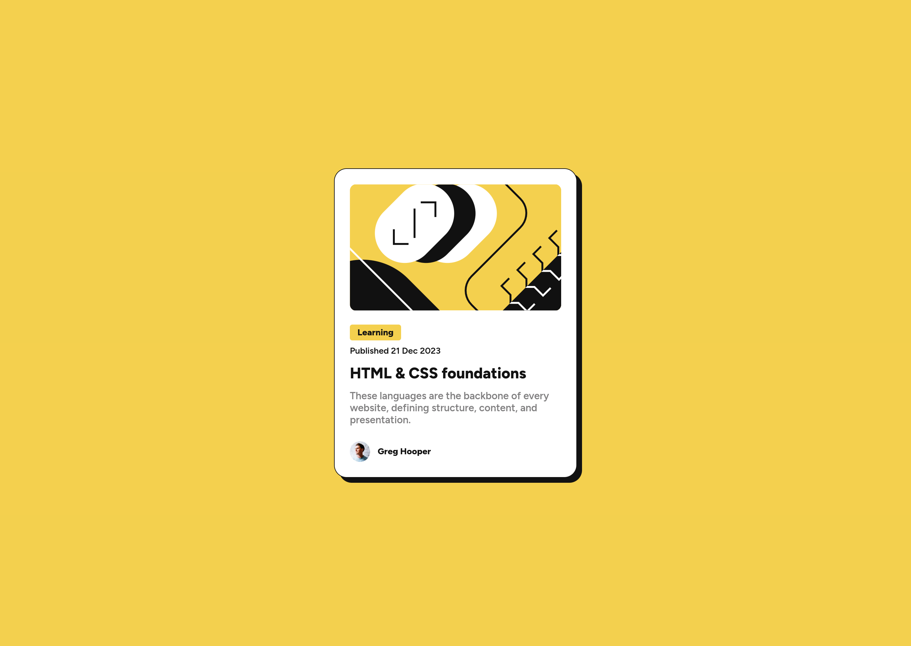
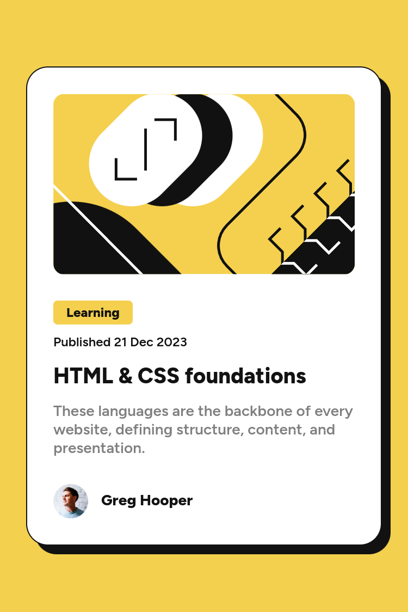

# Frontend Mentor - Blog preview card solution

This is a solution to the [Blog preview card challenge on Frontend Mentor](https://www.frontendmentor.io/challenges/blog-preview-card-ckPaj01IcS). Frontend Mentor challenges help you improve your coding skills by building realistic projects.

## Table of contents

- [Overview](#overview)
  - [The challenge](#the-challenge)
  - [Screenshot](#screenshot)
  - [Links](#links)
- [My process](#my-process)
  - [Built with](#built-with)
  - [What I learned](#what-i-learned)
- [Author](#author)

## Overview

### The challenge

Users should be able to:

- See hover and focus states for all interactive elements on the page

### Screenshot





### Links

- Solution URL: [Add solution URL here](https://your-solution-url.com)
- Live Site URL: [https://lunr-ish.github.io/blog-preview-card/](https://lunr-ish.github.io/blog-preview-card/)

## My process

### Built with

- Semantic HTML5 markup
- CSS custom properties
- Flexbox
- Mobile-first workflow

### What I learned

Adding local custom fonts

```css
/* For the variable font */
@font-face {
  font-family: "Figtree";
  src: url("./assets/fonts/Figtree-VariableFont_wght.ttf") format("truetype-variations");
  font-weight: 100 900;
}

/* For the static font */
@font-face {
  font-family: "Figtree";
  src: url("./assets/fonts/static/Figtree-SemiBold.ttf") format("truetype");
  font-weight: 500;
  font-style: normal;
}

@font-face {
  font-family: "Figtree";
  src: url("./assets/fonts/static/Figtree-ExtraBold.ttf") format("truetype");
  font-weight: 800;
  font-style: normal;
}
```

## Author

- Frontend Mentor - [@lunr-ish](https://www.frontendmentor.io/profile/lunr-ish)
- Twitter - [@lunr_ish](https://www.twitter.com/lunr_ish)
